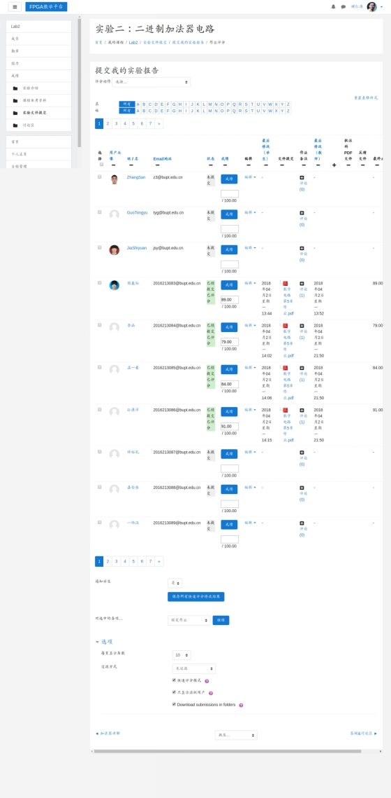

> 这是**FPGA教学平台**的使用手册，如果有疑问欢迎联系管理员。

[TOC]

# 1. 学生操作指南

## 1.1 如何登陆

 

点击登陆，待出现如下界面后输入学生的用户名和密码后点击登陆

 

现在你你便进入了你的个人主页，在这里你可以查看你已经和将要完成的课程，你的个人文件、日程表和此时在线的用户

 

 

## 1.2 学生日程管理

点击个人主页中的日程管理，你会看到你的课程会被自动添加上去。如果你需要自定义新日程，可以双击对应的天，然后填写相关信息

 

 

## 1.3 学生个人文件管理

可以通过拖曳文件这个框从而自动上传文件

 

 

## 1.4 学生参加课程

点击课程名（比如`Lab 2`）从而进入课程

 

 

在完成实验前，你应该先点击下载学习课程参考资料，然后下载填写实验报告，根据要求填写并点击提交我的实验报告提交

 

 

在老师披阅后点击查看反馈结果可以查看反馈

 

 

对于课程如果你有什么疑问，请点击答疑&讨论区，发布在该版块，老师会及时为你解答

 

## 1.5 学生查看可用的板子数

在实验的主页可以查看目前可用的板子数量；你可上传作业文件，确认提交并开始远程编译，最后查看反馈结果（PDF报告）

# 2. 教师操作指南

## 2.1 查看教授的课程及实验

 在课程分类下点击相应的课程（如点击数字电路与逻辑设计），进入实验界面

 

## 2.2 老师检查学生的作业并给出评价

点击实验名（比如实验二：二进制加法器电路），点击提交我的实验报告作业，再点击查看所有提交的作业

 

 

 

 

 

在进入上页面后可以填写成绩评价，填写完后要点击保存所有快速评分修改结果

## 2.3 老师私信学生

如果老师想和哪位学生单独交流，可以点击名字（比如孙潇洋），再点击消息即可

 

 

 

## 2.4 老师答复学生的疑问

学生在答疑&讨论区提问后老师可以在此区域查看并回复

